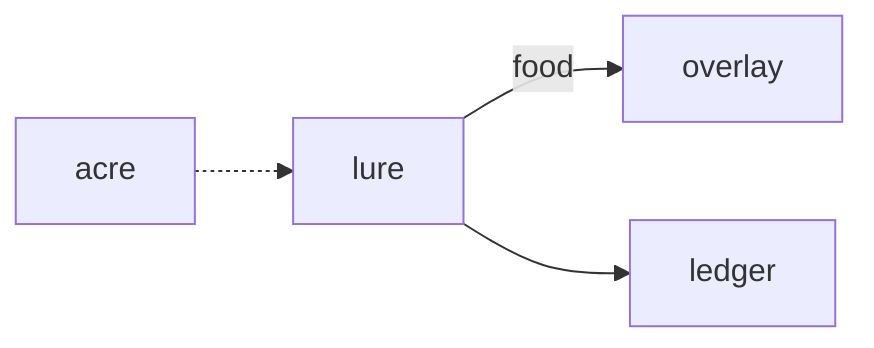

# Lure

**Pet Fishing Hole** — Cozy fishing hole to catch food and aquatic companion items for the overlay pets.

Part of [ComputerPets](https://github.com/RicheyWorks/computerpets). Map: [computerpets-ecosystem](https://github.com/RicheyWorks/computerpets-ecosystem).

| | |
| --- | --- |
| Status | Design scaffold — loop and engine frozen |
| License | MIT |
| Tokens | Minigames never mint or burn. Tired overlay, not a dead lineage. |
| First pet | [Meet Rui first](https://github.com/RicheyWorks/computerpets/blob/main/docs/START-HERE.md). This game is optional. |

## The loop

Feed is a care verb. Lure is how treats get made: Paint the clownfish fishes a reef, Rui fishes a river. Catch goes to inventory, then to feed.

## Who plays

Players feeding the care loop.

## What it is not

Not a way to catch someone else's pet. Trash is trash.

## Genre and engine

- Genre: **Cozy minigame**
- Engine: **Phaser.js**
- Stack: TypeScript · Phaser 3 · WebGL · species biomes · food items into care loop
- Default surface: `8080`

## Architecture



## How you play

1. Cast on a biome matching the active pet.
2. Timing bar + patience stat.
3. Rare splash = companion item, not a new species.
4. Trash can be recycled in Quarry later.

## First slice

Build this and stop.

**River biome for Rui, timing bar, catch becomes feed inventory.**

You know it works when: Tab-out pauses the bite. No wallet: local fish still feed Rui.

## Environment

Node 22

## Failure doctrine

Tab-out → pause the bite window. No wallet → local fish still feed Rui. Never catch another player's pet.

Canon rules that never yield:

- 210 living kinds. No illegal hybrids.
- Overlay pets can get tired, sick, or hide. Tokens are not burned by a minigame.
- Desktop walk stays the main quest. Closing Lure must leave Rui walking.

## Neighbors

- computerpets (feed inventory)
- computerpets-ledger (sell extra)
- computerpets-quests
- computerpets-lore (biome)

## Layout

```
computerpets-lure/
  README.md
  LICENSE
  docs/DESIGN.md
  src/                implementation lands here
```

## Run (Windows)

```powershell
cd app; npm install; npm run dev
```

Meet Rui first via the [flagship start-here](https://github.com/RicheyWorks/computerpets/blob/main/docs/START-HERE.md). This game is optional.

## Links

- Flagship: [RicheyWorks/computerpets](https://github.com/RicheyWorks/computerpets)
- This repo: [RicheyWorks/computerpets-lure](https://github.com/RicheyWorks/computerpets-lure)
- Map: [RicheyWorks/computerpets-ecosystem](https://github.com/RicheyWorks/computerpets-ecosystem)
- Design file: [docs/DESIGN.md](docs/DESIGN.md)

## License

MIT. See [LICENSE](LICENSE).

---

*Two hundred ten living kinds. Keep them so a line does not go quiet.*
