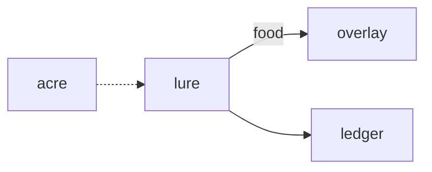

# Lure

**Pet Fishing Hole** — A planned fishing game where biome-specific catches become pet food and inventory.

Part of [ComputerPets](https://github.com/RicheyWorks/computerpets). Map: [computerpets-ecosystem](https://github.com/RicheyWorks/computerpets-ecosystem).

[Status](#status) · [Design](docs/DESIGN.md) · [Contributor start](#contributor-start) · [Ecosystem](https://github.com/RicheyWorks/computerpets-ecosystem)

| Project | At a glance |
| --- | --- |
| Status | Design scaffold; not runnable yet |
| License | MIT |
| Tokens | Minigames never mint or burn. Tired overlay, not a dead lineage. |
| First pet | [Flagship start guide](https://github.com/RicheyWorks/computerpets/blob/main/docs/START-HERE.md) |

## Status

This repository contains a [design](docs/DESIGN.md) and a [source placeholder](src/index.ts). It has no runnable application, build manifest, automated tests, or CI workflow.

The experience, interfaces, integrations, and safeguards below are **implementation plans**, not supported features. The first implementation slice defines the initial contribution target.

## Planned experience

Feed is a care verb. Lure is how treats get made: Paint the clownfish fishes a reef, Rui fishes a river. Catch goes to inventory, then to feed.

## Intended audience

Players feeding the care loop.

## Out of scope

Not a way to catch someone else's pet. Trash is trash.

## Planned genre and engine

- Genre: **Cozy minigame**
- Engine: **Phaser.js**
- Stack: TypeScript · Phaser 3 · WebGL · species biomes · food items into care loop
- Proposed surface: `8080`

## Proposed integration



## Proposed play loop

1. Cast on a biome matching the active pet.
2. Timing bar + patience stat.
3. Rare splash = companion item, not a new species.
4. Trash can be recycled in Quarry later.

## First implementation slice

Initial implementation target:

**River biome for Rui, timing bar, catch becomes feed inventory.**

Acceptance targets: Tab-out pauses the bite. No wallet: local fish still feed Rui.

## Planned environment

Node 22

## Planned safeguards

Tab-out → pause the bite window. No wallet → local fish still feed Rui. Never catch another player's pet.

Design constraints:

- 210 living kinds. No illegal hybrids.
- Overlay pets can get tired, sick, or hide. Tokens are not burned by a minigame.
- Desktop walk stays the main quest. Closing Lure must leave Rui walking.

## Related projects

- [computerpets](https://github.com/RicheyWorks/computerpets) (feed inventory)
- [computerpets-ledger](https://github.com/RicheyWorks/computerpets-ledger) (sell extra)
- [computerpets-quests](https://github.com/RicheyWorks/computerpets-quests)
- [computerpets-lore](https://github.com/RicheyWorks/computerpets-lore) (biome)

## Layout

```
computerpets-lure/
  README.md
  LICENSE
  docs/DESIGN.md
  src/                implementation lands here
```

## Contributor start

With Git and PowerShell, clone the scaffold and read its design and source marker:

```powershell
git clone https://github.com/RicheyWorks/computerpets-lure.git
Set-Location computerpets-lure
Get-Content .\docs\DESIGN.md
Get-Content .\src\index.ts
```

Start with the [first implementation slice](#first-implementation-slice). Add the minimum project setup and tests needed for that slice, then document verified run commands. The proposed stack above is a design choice; there is no install or launch command for this checkout yet.

## Links

- Flagship: [RicheyWorks/computerpets](https://github.com/RicheyWorks/computerpets)
- This repo: [RicheyWorks/computerpets-lure](https://github.com/RicheyWorks/computerpets-lure)
- Map: [RicheyWorks/computerpets-ecosystem](https://github.com/RicheyWorks/computerpets-ecosystem)
- Design file: [docs/DESIGN.md](docs/DESIGN.md)

## License

MIT. See [LICENSE](LICENSE).

---

*Two hundred ten living kinds. Keep them so a line does not go quiet.*
